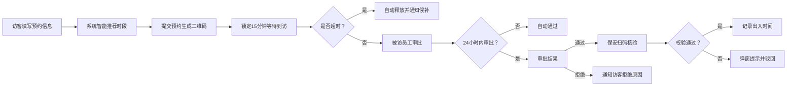

## 1. 产品概述

企业访客预约与出入管理平台是一套整合访客在线预约、审批流转、通行核验与数据追溯全链路的企业级管理系统。解决传统访客登记效率低、安全管控弱、数据追溯难的痛点。

- 目标用户：企业访客、企业员工（被访人）、安保人员、系统管理员
- 产品价值：提升访客体验、强化企业安全管理、实现访客数据数字化与智能化

## 2. 核心功能

### 2.1 用户角色

| 角色 | 进入方式 | 核心权限 |
|------|----------|----------|
| 访客 | 手机号登录/预约入口 | 提交预约、查看本人预约记录、获取通行二维码 |
| 员工 | 企业账号登录 | 审批本部门访客、转派审批、查看本部门访客记录 |
| 保安 | 安保账号登录 | 扫码核验访客、记录出入时间、查看黑名单 |
| 管理员 | 管理员账号登录 | 全局配置、黑名单管理、查看所有数据、导出报表 |

### 2.2 功能模块

1. **首页大屏**：实时数据展示、今日预约量、已到访人数、拒绝次数、热门被访部门排行
2. **访客预约**：填写预约信息、智能时段推荐、二维码生成、超时自动释放
3. **审批管理**：被访员工审批/转派、超时自动通过、审批状态跟踪
4. **通行核验**：保安扫码、有效期校验、黑名单校验、出入时间记录
5. **黑名单管理**：添加/移除黑名单、拦截提示、原因记录
6. **数据报表**：多条件筛选、月度访客分析报表、一键导出
7. **权限配置**：三级权限管理、预约规则配置

### 2.3 页面详情

| 页面名称 | 模块名称 | 功能描述 |
|----------|----------|----------|
| 登录页 | 角色选择登录 | 访客/员工/保安/管理员不同角色登录入口 |
| 首页大屏 | 数据看板 | 实时数据卡片、趋势图表、部门排行、10秒自动刷新 |
| 访客预约页 | 预约表单 | 姓名/电话/被访员工/事由填写、智能时段选择、二维码展示 |
| 预约详情页 | 预约信息 | 预约详情、二维码、状态追踪、取消预约 |
| 审批中心 | 审批列表 | 待审批/已审批列表、审批操作、转派功能 |
| 扫码核验页 | 核验界面 | 摄像头扫码、手动输入、核验结果弹窗、出入记录 |
| 黑名单管理 | 黑名单列表 | 增删改查、原因备注、批量操作 |
| 数据报表页 | 报表中心 | 日期/部门/姓名筛选、月度分析、导出Excel |
| 系统设置 | 规则配置 | 预约规则、时段配置、权限管理 |

## 3. 核心流程

访客填写预约信息 → 系统根据预约密度推荐时段 → 提交预约生成二维码（锁定15分钟）→ 被访员工审批（超24小时自动通过）→ 访客到访保安扫码核验 → 系统校验有效期/黑名单 → 核验通过记录出入时间 / 核验不通过弹窗驳回。若预约超时未到自动释放并通知候补访客。

## 4. 用户界面设计

### 4.1 设计风格

- 主色调：深海蓝 `#1e3a5f`，代表专业与信任
- 辅助色：科技青 `#00d4aa`，代表通过与成功；警示橙 `#ff6b35`，代表提醒与警告
- 中性色：冷灰系 `#f8fafc` `#e2e8f0` `#64748b` `#1e293b`
- 按钮风格：圆角 8px，主按钮渐变填充，次按钮描边，悬停微放大动效
- 字体：标题使用「思源黑体 Bold」，正文使用「思源黑体 Regular」，数字使用等宽字体
- 布局风格：卡片式布局 + 顶部导航 + 左侧菜单，数据大屏使用深色背景配荧光色数据
- 图标风格：Lucide 线性图标，统一 20px 尺寸

### 4.2 页面设计概览

| 页面名称 | 模块名称 | UI元素 |
|----------|----------|--------|
| 登录页 | 角色选择 | 渐变背景、角色卡片选择、浮动动画、玻璃拟态登录框 |
| 首页大屏 | 数据看板 | 深色背景、发光数据卡片、实时折线图、排行条形图、脉冲动画 |
| 访客预约页 | 预约表单 | 分步表单、时段选择热力图、二维码动画展示 |
| 审批中心 | 审批列表 | 标签页切换、卡片式列表、快捷审批按钮、状态徽标 |
| 扫码核验页 | 核验界面 | 全屏扫描框、扫描线动画、核验结果大弹窗、状态动效 |
| 黑名单管理 | 黑名单列表 | 表格布局、搜索框、批量操作栏、警示色标记 |

### 4.3 响应式

- 桌面端优先（1440px+），适配 1024px 平板
- 访客预约页和扫码核验页适配移动端（375px+）
- 数据大屏保持 16:9 固定比例展示

### 4.4 动效设计

- 页面加载：元素渐入 + 上移，stagger 100ms
- 二维码：生成时的脉冲发光动效
- 数据刷新：数字滚动变化动画
- 按钮：hover 时 scale(1.02) + 阴影加深
- 核验结果：成功时绿色对勾绘制动画，失败时红色叉号抖动动画
