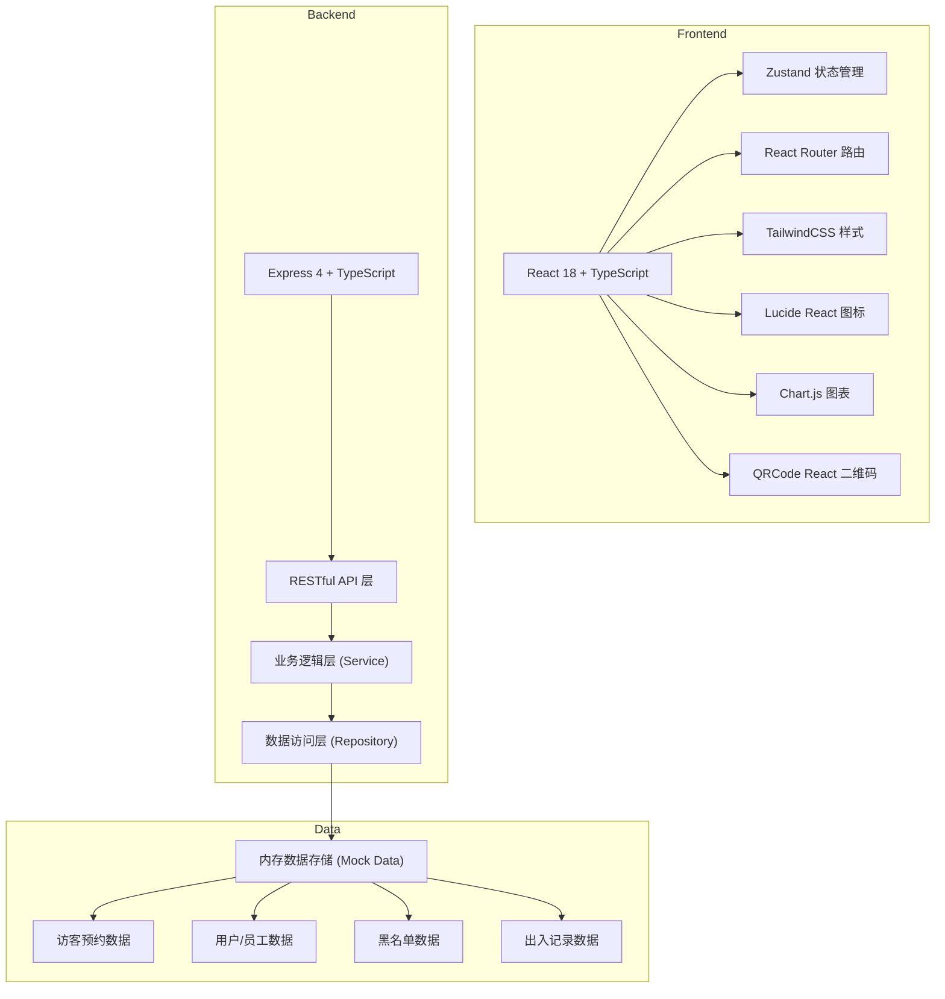
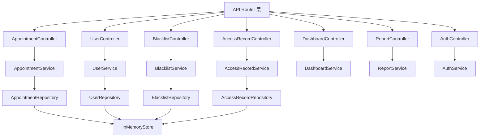
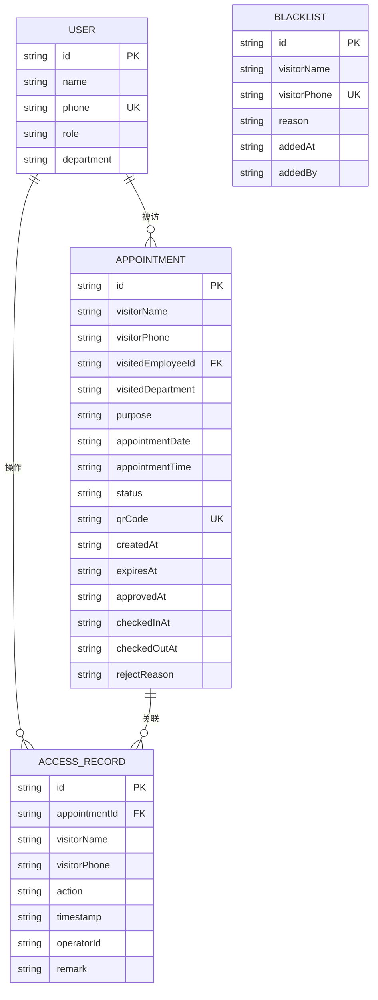

## 1. 架构设计



## 2. 技术描述

- 前端：React 18 + TypeScript + TailwindCSS 3 + Vite
- 初始化工具：vite-init (react-express-ts 模板)
- 后端：Express 4 + TypeScript
- 数据库：内存 Mock 数据（开发演示用），可后续迁移至 SQLite/PostgreSQL
- 状态管理：Zustand
- 路由：react-router-dom
- 图表：chart.js + react-chartjs-2
- 二维码：qrcode.react
- 图标：lucide-react

## 3. 路由定义

| 路由 | 用途 | 权限 |
|------|------|------|
| /login | 登录页（角色选择） | 公开 |
| /dashboard | 首页大屏数据看板 | 管理员/保安 |
| /visitor/appointment | 访客预约表单 | 访客/公开 |
| /visitor/my-appointments | 我的预约记录 | 访客 |
| /visitor/appointment/:id | 预约详情（含二维码） | 访客 |
| /approval | 审批中心 | 员工 |
| /security/verify | 扫码核验页面 | 保安 |
| /security/records | 出入记录 | 保安/管理员 |
| /admin/blacklist | 黑名单管理 | 管理员 |
| /admin/reports | 数据报表 | 管理员 |
| /admin/settings | 系统设置 | 管理员 |

## 4. API 定义

```typescript
// 访客预约相关
interface Appointment {
  id: string;
  visitorName: string;
  visitorPhone: string;
  visitedEmployeeId: string;
  visitedEmployeeName: string;
  visitedDepartment: string;
  purpose: string;
  appointmentDate: string;
  appointmentTime: string;
  status: 'pending' | 'approved' | 'rejected' | 'expired' | 'checked_in' | 'checked_out';
  qrCode: string;
  createdAt: string;
  expiresAt: string;
  approvedAt?: string;
  checkedInAt?: string;
  checkedOutAt?: string;
  rejectReason?: string;
}

// 用户相关
interface User {
  id: string;
  name: string;
  phone: string;
  role: 'visitor' | 'employee' | 'security' | 'admin';
  department?: string;
}

// 黑名单相关
interface BlacklistItem {
  id: string;
  visitorName: string;
  visitorPhone: string;
  reason: string;
  addedAt: string;
  addedBy: string;
}

// 出入记录
interface AccessRecord {
  id: string;
  appointmentId: string;
  visitorName: string;
  visitorPhone: string;
  action: 'check_in' | 'check_out' | 'rejected';
  timestamp: string;
  operatorId: string;
  remark?: string;
}

// API Endpoints
// GET    /api/appointments              获取预约列表（支持筛选）
// GET    /api/appointments/:id          获取预约详情
// POST   /api/appointments              创建预约
// PUT    /api/appointments/:id/status   更新预约状态（审批/签入/签出）
// GET    /api/appointments/time-slots   获取可预约时段（带密度推荐）
// GET    /api/users                     获取用户列表（员工）
// GET    /api/dashboard/stats           获取首页大屏统计数据
// GET    /api/blacklist                 获取黑名单列表
// POST   /api/blacklist                 添加黑名单
// DELETE /api/blacklist/:id             移除黑名单
// GET    /api/access-records            获取出入记录
// POST   /api/access-records            创建出入记录
// GET    /api/security/verify/:qrCode   核验二维码
// POST   /api/auth/login                登录
// GET    /api/reports/monthly           获取月度报表数据
```

## 5. 服务端架构图



## 6. 数据模型

### 6.1 数据模型定义 (ER图)



### 6.2 初始 Mock 数据

```typescript
// 初始用户数据
const initialUsers: User[] = [
  { id: 'u1', name: '张经理', phone: '13800000001', role: 'employee', department: '技术部' },
  { id: 'u2', name: '李主管', phone: '13800000002', role: 'employee', department: '市场部' },
  { id: 'u3', name: '王保安', phone: '13900000001', role: 'security', department: '安保部' },
  { id: 'u4', name: '赵管理员', phone: '13700000001', role: 'admin', department: '行政部' },
];

// 初始黑名单
const initialBlacklist: BlacklistItem[] = [
  { id: 'b1', visitorName: '陈某某', visitorPhone: '13600000001', reason: '上次来访有不当行为', addedAt: '2026-06-01T10:00:00Z', addedBy: 'u4' },
];

// 初始预约数据
const initialAppointments: Appointment[] = [
  {
    id: 'a1', visitorName: '刘客户', visitorPhone: '13500000001',
    visitedEmployeeId: 'u1', visitedEmployeeName: '张经理', visitedDepartment: '技术部',
    purpose: '项目对接洽谈', appointmentDate: '2026-06-15', appointmentTime: '10:00',
    status: 'approved', qrCode: 'QR-A1-XXXX',
    createdAt: '2026-06-14T09:00:00Z', expiresAt: '2026-06-15T10:15:00Z',
    approvedAt: '2026-06-14T10:30:00Z'
  },
];
```
